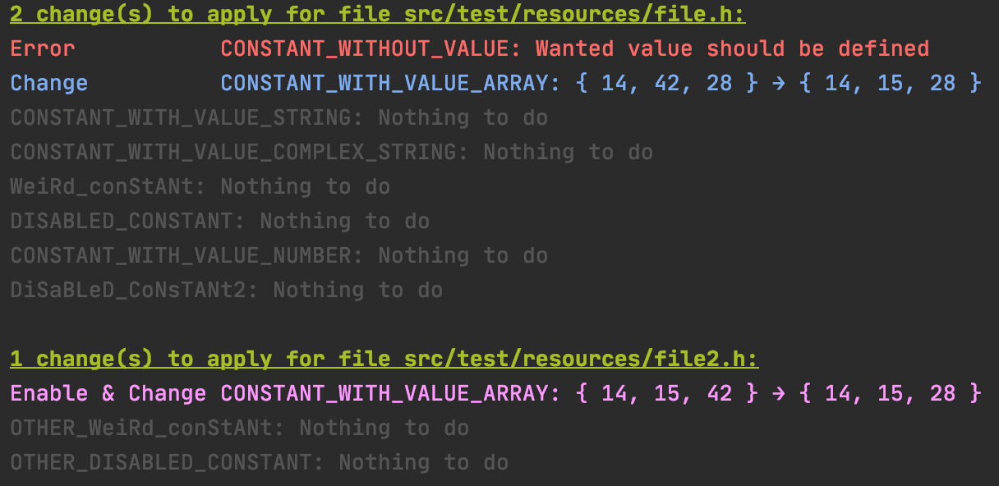

[](https://www.paypal.com/cgi-bin/webscr?cmd=_donations&business=CQ6WPNYRBSWUU&item_name=Buy+me+a+beer&currency_code=EUR)

# Marlin Console Configurator

*The life is too short to configure Marlin*

If you want to modify and share easily your Marlin configuration, Marlin Console Configurator is for **YOU**

- [Marlin Console Configurator](#marlin-console-configurator)
  * [Go quickly with docker](#go-quickly-with-docker)
  * [Docker alternative: Downloading binaries](#docker-alternative-downloading-binaries)
    + [Linux, MacOS, unix-like](#linux-macos-unix-like)
    + [Windows](#windows)
  * [Execute from sources](#execute-from-sources)
  * [How to use it](#how-to-use-it)
    + [Concrete example: show all changes without saving (just output to console)](#concrete-example-show-all-changes-without-saving-just-output-to-console)
    + [Concrete example: show all changes and save modifications to Marlin firmware files](#concrete-example-show-all-changes-and-save-modifications-to-marlin-firmware-files)
    + [Concrete example: Create a profile from your current config](#concrete-example-create-a-profile-from-your-current-config)
  * [Usage](#usage)
  * [Credits](#credits)

Cool things:
- No need to fork Marlin repository, and have a git pull-rebase-conflicts-f**k. Just download/clone last Marlin sources and run marlin-console-configuration onto wanted profile.
  - Hey bro', I have 5 printers, and it is a loot difficult to maintain Marlin up-to-date for all printers...
  - No problem, just use same Marlin repository, while you just have to apply 5 different profiles
  - Naaaaahh, really ?
  - Yes, it is as simple as it is
- You can share your profile with friends, or on a tutorial.
- It is not doing anything else than modifying C/C++ header files (`.h`), so it don't care about Marlin version !
- It will not add/remove/reorder constants, but just modifying only what is needed :)

Bad things:
- This tool is so quick that you have no time to take a coffee while it is running :D
- Complex guys that loves complex things won't love it... Too simple !


## Go quickly with docker
Just run the following command.

```shell script
cd /path/to/Marlin
docker run --rm -it -v ${PWD}:/app/files chuckame/marlin-console-configurator [command] [command options]
```

Since docker need to access to your Marlin configuration folder/files AND your profile, this is why there is `${PWD}:/app/files` volume.
But, because of this volume, you cannot go trought the current folder's parents using `../` from marlin-console-configurator parameters.

Example for `apply` command with the following folder architecture:
```
3d-printing/
├── profiles/
│   ├── ender-3-pro-base.yaml
│   ├── ender-3-pro-mbl.yaml
│   ├── ender-3-pro-runout-sensor.yaml
│   └── ender-3-pro-abl.yaml
└── MarlinFirmware/
    └── Marlin/
        ├── Configuration.h
        └── Configuration_adv.h
```
Execute the command:
```shell script
cd 3d-printing/
docker run --rm -it -v ${PWD}:/app/files chuckame/marlin-console-configurator apply ./MarlinFirmware/Marlin -p ./profiles/ender-3-pro.yaml
```

> Actually only compatible with amd64 architectures. If you want to execute on other arch, like armv7 for raspberry pi, you can directly [use binaries](#downloading-binaries), while you can create an issue if you really want marlin-console-configurator on your arch.

## Docker alternative: Downloading binaries
Download `marlin-console-configurator.zip` from [Releases](https://github.com/Chuckame/marlin-console-configurator/releases) and extract it.

The unzipped folder will contain those files:
```
marlin-console-configurator/
├── bin/
│   ├── marlin-console-configurator      # Entrypoint script for unix-like OS
│   └── marlin-console-configurator.bat  # Entrypoint script for windows OS
└── lib/
    └── marlin-console-configurator.jar  # The marlin-console-configurator
```

How to use it:

### Linux, MacOS, unix-like
```shell script
cd ./marlin-console-configurator/bin
./marlin-console-configurator help
```

### Windows
```shell script
cd ./marlin-console-configurator/bin
marlin-console-configurator.bat help
```

## Execute from sources
```shell script
./gradlew bootRun help
```

## How to use it

### Concrete example: show all changes without saving (just output to console)
```shell script
marlin-console-configurator apply ./Marlin -p ./ender-3-base.yml ./ender-3-abl.yml
```
You will see something like this:



### Concrete example: show all changes and save modifications to Marlin firmware files
```shell script
marlin-console-configurator apply ./Marlin -p ./ender-3-abl.yml --save
```
> Only needed modifications will be saved.

### Concrete example: Create a profile from your current config
```shell script
marlin-console-configurator generate-profile ./Marlin -o ./my-new-profile.yml
```

## Usage

```
Usage: marlin-console-configurator [command] [command options]
  Commands:
    apply      Apply the given profile to marlin constants files, that will enable, change value or disable constants into marlin 
            configuration files
      Usage: apply [options] /path1 /path2 ...	File or directory path(s) where all changes will be applied
        Options:
        * --profiles, -p
            Profile's path(s) (space separated) containing changes to apply. Format: yaml
          --save, -s
            When is present, will save changes to files. Else, just display changes without saving
            Default: false
          --yes, -y
            when present, the changes will be saved without prompting the user
            Default: false

    diff      Display differences between marlin configuration files
      Usage: diff [options]
        Options:
        * --left
            marlin configuration folder or files paths for the base of diff
        * --right
            marlin configuration folder or files paths to know what was changed since --source paths

    generate-profile      Generate a profile from given marlin constants files
      Usage: generate-profile [options] /path1 /path2 ...	The marlin constants folder or files paths
        Options:
        * --output, -o
            The output profile path, will be overwritten if already existing file. If 'console' is specified, the profile will just be 
            printed to the console

    help      Display this help message
      Usage: help
```

## Tasks

### Todo
- Can create a backup.yaml when applying

## Credits
Made with :heart: by Chuckame
